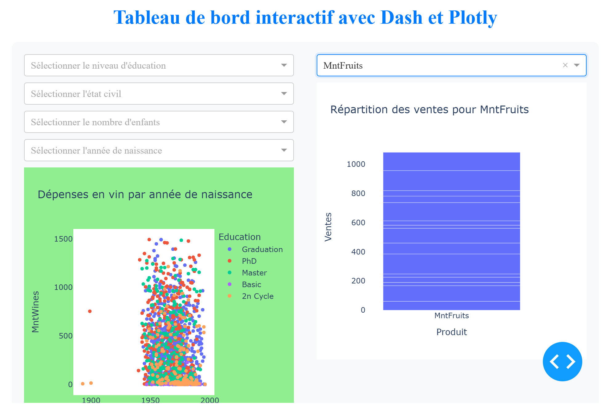

# Analyse du Comportement des Clients 📊

Ce projet vise à étudier le comportement des clients d'une entreprise en analysant différents attributs et à classer les clients dans des catégories afin d'aider l'entreprise à prendre des décisions économiques et stratégiques plus éclairées pour conserver et attirer plus de clients à moindre coût. 💡

## Objectif 🎯

L'objectif principal de ce projet est de :

- Analyser les données clients pour comprendre leurs comportements d'achat.
- Classer les clients dans des catégories en fonction de leurs caractéristiques.
- Identifier la catégorie de clients la plus importante pour l'entreprise.
- Créer un tableau de bord interactif mettant en évidence les indicateurs de performance clés (KPI). 🚀

## Contenu du Projet 📂

- **Dataset**: Un lien vers le jeu de données utilisé pour l'analyse.
- **Code**: Tout le code utilisé pour l'analyse des données, y compris les scripts Python.
- **Rapport**: Un rapport détaillé sur les résultats de l'analyse, y compris les catégories de clients identifiées et les recommandations stratégiques.
- **Tableau de Bord Interactif**: Un tableau de bord interactif créé avec Plotly et Dash pour visualiser les KPI. 📈

## Utilisation 🛠️

1. Téléchargez le jeu de données à partir du lien fourni.
2. Exécutez les scripts d'analyse pour traiter les données et générer des résultats.
3. Consultez le rapport pour comprendre les résultats de l'analyse et les recommandations.
4. Explorez le tableau de bord interactif pour visualiser les KPI et les insights. 🔍

## Setup Utilisé 🛠️

- Pandas 🐼
- Numpy 🔢
- Matplotlib 📊
- Seaborn 🌊
- Power BI 💻
- Plotly 📊
- Dash 🚀
- Scipy 📈
- Statsmodels 📊

## Dataset 📊

Le jeu de données utilisé dans ce projet contient des informations sur les clients, y compris les attributs suivants :

| Groupe         | Attribut                  | Description                                                             |
|----------------|---------------------------|-------------------------------------------------------------------------|
| **People**     | ID                        | Identifiant unique du client                                            |
|                | Year_Birth                | Année de naissance du client                                            |
|                | Education                 | Niveau d'éducation du client                                            |
|                | Marital_Status            | Statut marital du client                                                |
|                | Income                    | Revenu annuel du foyer du client                                        |
|                | Kidhome                   | Nombre d'enfants dans le foyer du client                                |
|                | Teenhome                  | Nombre d'adolescents dans le foyer du client                            |
|                | Dt_Customer               | Date d'inscription du client auprès de l'entreprise                     |
|                | Recency                   | Nombre de jours depuis le dernier achat du client                       |
|                | Complain                  | 1 si le client s'est plaint au cours des 2 dernières années, 0 sinon    |
| **Products**   | MntWines                  | Montant dépensé en vin au cours des 2 dernières années                  |
|                | MntFruits                 | Montant dépensé en fruits au cours des 2 dernières années               |
|                | MntMeatProducts           | Montant dépensé en viande au cours des 2 dernières années               |
|                | MntFishProducts           | Montant dépensé en poisson au cours des 2 dernières années              |
|                | MntSweetProducts          | Montant dépensé en sucreries au cours des 2 dernières années            |
|                | MntGoldProds              | Montant dépensé en or au cours des 2 dernières années                   |
| **Promotion**  | NumDealsPurchases         | Nombre d'achats effectués avec une remise                               |
|                | AcceptedCmp1 à AcceptedCmp5 | 1 si le client a accepté l'offre dans la campagne correspondante, 0 sinon |
|                | Response                  | 1 si le client a accepté l'offre dans la dernière campagne, 0 sinon     |
| **Place**      | NumWebPurchases           | Nombre d'achats effectués via le site web de l'entreprise               |
|                | NumCatalogPurchases       | Nombre d'achats effectués à l'aide d'un catalogue                       |
|                | NumStorePurchases         | Nombre d'achats effectués directement en magasin                        |
|                | NumWebVisitsMonth         | Nombre de visites sur le site web de l'entreprise le mois dernier       |

Vous pouvez télécharger le dataset à partir du lien suivant :
[Dataset](https://drive.google.com/file/d/10VREJosWMuFSPrG4lkkTaZVu58rioiY-/view?usp=drive_link)

## Tableau de Bord Interactif 📈

Ci-dessus se trouve un tableau de bord interactif créé avec Plotly et Dash. Vous pouvez y accéder en cliquant sur l'image.
